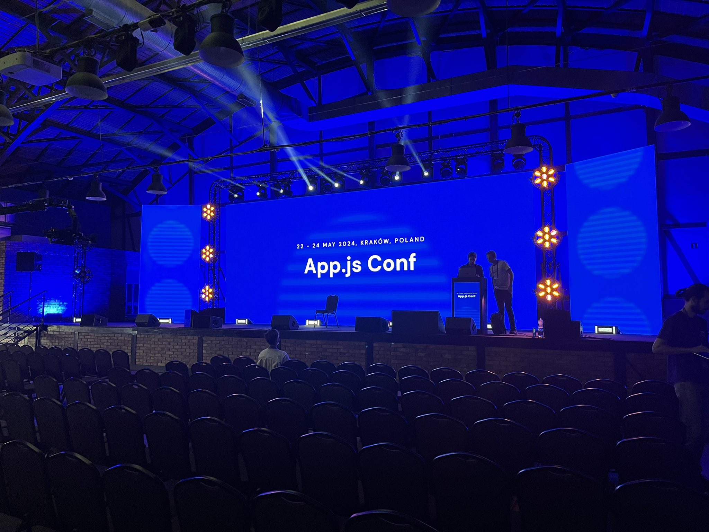
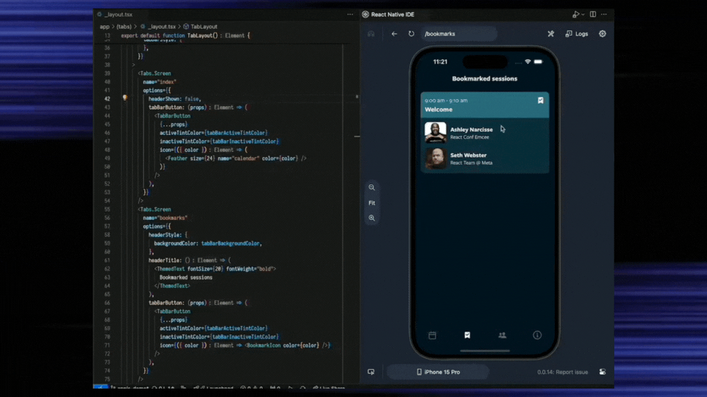
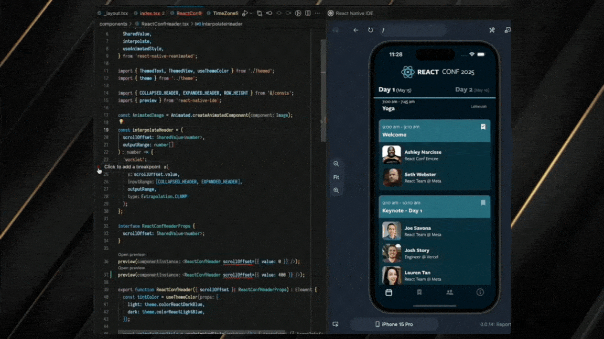
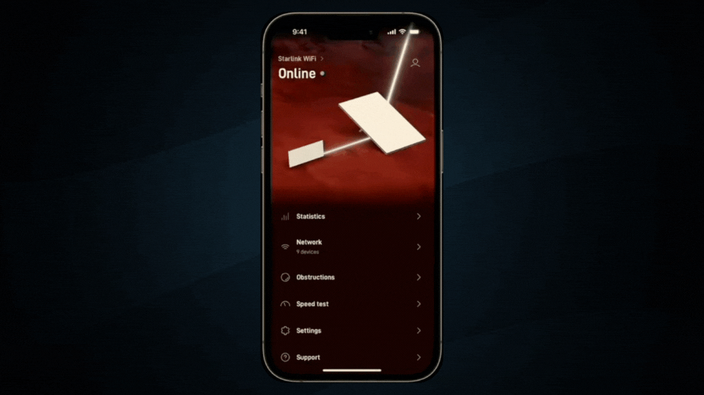
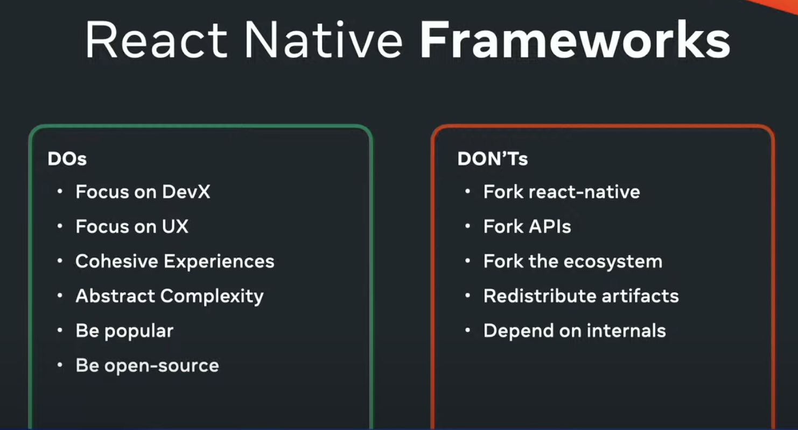

# What’s new in App.js Conf 2024?

Hey notJust Developers,

One of the biggest and most exciting conferences on **React Native**, organized by [**Software Mansion**](https://x.com/swmansion) with [**Expo**](https://x.com/expo) as the main partner and [notJust.dev](https://www.notjust.dev/) as the Media Partner among others, has recently concluded. The three-day event started on May 22nd, filled with exciting announcements. Let’s dive in 🚀

1. React Native Skia with GPU 🔥
2. React Native IDE
3. React Server Components in Expo Router
4. Starlink with React Native 💯
5. React Native Frameworks

# React Native Skia with GPU

The React Native Skia team [**released V1.0 in March**](https://www.notjust.dev/blog/react-native-skia-1-0) this year to complete the **drawing features** by providing the **Paragraph API** & **Atlas API**. After that release, the team felt that React Native Skia has the best drawing capabilities, but it should also be able to be used with any **data source** (e.g., Image, Video, 3D projections, etc).

### React Native Skia Video

React Native Skia already provides a feature where **images** can be rendered using a **shader**. A shader is a small program that runs on the **GPU (Graphics Processing Unit)** and instructs the GPU on how to draw each pixel on the screen. Shaders in Skia are written using Skia’s shading language, similar to GLSL (OpenGL Shading Language). Below is an example of **image shading** using the React Native Skia **Image Shaders API**.

Did you notice that the image pixels were re-rendered when we slid the image from right to left? Yes, that’s the effect of the **Image Shaders API**.

However, this shader was not provided with the video. Therefore, [**William**](https://x.com/wcandillon) announced that from now on, React Native Skia can be applied to **videos** too. Thus, the static image shader examples above can now be applied to videos, and shaders from React Native Skia can be used on **videos** as shown below.

It’s pretty cool, right? From now on, it’s also possible to apply filters and effects to videos using React Native Skia, just like the ones shown below.

Now that we can apply **shaders** to videos as well, it opens the door for **Ambient Mode** (soft glow of colors from the video onto the surroundings of the video) while playing a Video.

### The Native Buffer API

The above React Native Skia Video was developed using a new API named **`Native Buffers`**, created through the collaboration of [**William**](https://x.com/wcandillon) & [**Margelo**](https://x.com/margelo_io) team, led by [**Marc**](https://x.com/mrousavy). It uses **platform-specific** GPU APIs (**Metal** for **iOS** & **OpenGL** for **Android**) which enable **direct GPU access** and data processing for **efficient graphics rendering**, **using** the following memory management classes from different Native SDKs.

- Android uses the “HardwareBuffer” class
- iOS uses the “PixelBuffer” class
- Web uses the “CanvasImageSource” class

**`NOTE:`** **React Native Vision Camera** is now using **React Native Skia**; however, its use is optional. This means you can use the React Native Skia **GPU feature** only when necessary.

### WebGPU: 3D API with React Native Skia

Previously, a significant portion of 3D animation tasks depended heavily on the **CPU**. However, these have now been transitioned to the **GPU**, with examples including 3D transformations (Ex: **Rotating**). Below is the **current architecture** of React Native Skia.

Here, you can see that **`Skia`** runs on top of the **`OpenGL`** GPU API for Android and the **`Metal`** GPU API for iOS. However, have you noticed that this approach wastes a lot of time because the OpenGL GPU code will not work for Metal GPU, and vice versa? Consequently, the React Native Skia team has planned to **modernize this architecture**.

The plan is to implement a **unified 3D API** (**‘WebGPU’**) across both **iOS** and **Android**. Skia will operate on top of this unified API **‘WebGPU’**. This will enable the use of libraries such as **`Three.js`** (used to create and display animated 3D computer graphics) on top of Skia.

Three reasons why **‘WebGPU’** was chosen as the backend for Skia.

1. ⁠It modernized the **React Native Skia** backend API
2. ⁠⁠It creates a unified 3D API across IOS and Android
3. It has the general computing capabilities to run the operations in GPU instead of CPU. Ex: To run an AI model needs high GPU capabilities.

Below is the new architecture of React Native Skia.

Let’s understand each point of this new architecture of React Native Skia 🚀

- Vulkan: It is the new & modern **GPU API for Android**. Previously the team was using OpenGL but it is not supported in the newest Skia backend.
- Metal: Metal is already a **modern GPU API for iOS** & the team is using it from old architecture.
- Dawn WebGPU: It is the C++ implementation of Google **‘WebGPU’**. It reduced 1000 lines of code (by Vulkan or Metal) to 20 lines for a triangle to draw.
- Skia Graphite: It is the new modern backend for modern GPU APIs (Ex: Metal, Vulkan, etc). It is a **high-level graphics library** that focuses on rendering with support for GPU acceleration (offloading compute-intensive tasks from the CPU to the GPU) through Vulkan and other backends.

# React Native IDE

Another exciting news is that [**Krzysztof Magiera**](https://x.com/kzzzf), co-founder of [**Software Mansion**](https://x.com/swmansion), has announced the **open beta program** for React Native IDE. It has been 9 months since they began working on it, and they have made significant progress.

### Too much stuff for setting up environment 🤦

When someone starts to build a React Native app using the React Native CLI, they need to perform lots of tasks according to the React Native website to set up the development environment. For example, tons of commands must be installed, **CocoaPods** must be set up, and **Ruby** must be set up with **correct versions**, among other complex tasks, are involved.

### React Native IDE in action 🚀

React Native IDE made it easy for react native developers to set up the environment. The IDE is a Visual Studio Code extension that only runs on macOS now. Below is a screenshot from Visual Studio Code.

Let’s explore the most exciting features of the React Native IDE.

1. Snap Recording
2. Component Inspector
3. Access logs easily
4. Navigation made easier
5. Better Components preview
6. Break Points without any other application 🚀

### Snap Recording

With the React Native IDE, you can record a video capturing 5-7 seconds of the history of your previous interactions within the app, as shown below.

### Component Inspector

You can **left-click** on any JSX component displayed on the device, as shown below, to inspect the component’s **`<View/>`** hierarchy. Clicking on the component will open the corresponding code in VSCode.

### Access logs easily

React Native IDE truly enables you to open all your **logs** in VSCode, as illustrated below.

When you click on the **“Logs”** button at the top right, it will open the log menu at the bottom. Additionally, you can navigate to the corresponding code from each log by clicking on the box indicated in green.

### Navigation made easier

React Native IDE has greatly simplified **navigation**, as shown below. You can view all your **previous navigation history** directly from the IDE. The example below uses the Expo router, which is a file-based routing system.

### Better Components preview

React Native IDE offers a **`preview()`** method that allows you to get a preview of the component you are developing, as shown below 🚀.

### Break Points without any other application 🚀

Another exciting feature is that React Native IDE supports breakpoints. You can even add breakpoints inside native code 🔥.

# React Server Components in Expo Router

Another exciting news is that [**Evan Bacon**](https://x.com/Baconbrix) from the [**Expo**](https://x.com/expo) team has introduced **React Server Components** across all platforms (web, desktop, mobile) via the **Expo Router**.

The **Expo Router** AI app (the rightmost app below) uses Server-driven UI but with an **RSC data pattern** (where the server sends **JSX** code directly to the **client device** instead of **JSON data**). This approach allows users to interact with the UI seamlessly. For example, Evan Bacon demonstrated this by performing a long press on an image, which opened a menu. Moreover, the RSC data pattern enables the integration of native access, such as scheduling a date in the calendar, with the rendered JSX component.

**NOTE:** **Evan Bacon** delivered the same talk a couple of weeks ago at React Conf 2024, and we have already explained this talk in detail in the previous newsletter **“🚀 What’s new in React Conf 2024”.** You will also find it as a blog post on the [**NotJustDev website**](https://www.notjust.dev/blog) later. 💯

# Starlink with React Native

Starlink is a space-based internet service provider that offers high-speed, low-latency internet from space to nearly any location on the planet. Starlink is currently available in 100 countries and has over 3 million users.

[**Aaron**](https://x.com/aarongrider) from [**SpaceX**](https://x.com/SpaceX) and his team are building the [**Starlink**](https://x.com/Starlink) mobile app by using [**Expo**](https://x.com/expo). The app is provided alongside the Starlink device and serves as the primary interface for configuring the local network, managing services, troubleshooting connectivity issues, and finding and installing a location without obstructions.

### Sky Scanner By ExpoGL

Sky Scanner is a tool in the Starlink app that helps users choose an installation location for the Starlink device by informing them of how much obstruction is in the sky and the quality of service they will receive from that location. This was the very first tool built in the app, by using a 3D effect. The libraries that were used are:

- Expo-camera
- Expo-asset
- Three.js
- ExpoGL & some other

By using **`ExpoGL`** and **`Three.js`**, the team built a real-time rendering of dots on the screen (as seen below) and a progress bar. Additionally, the Starlink team developed a native module to receive the device’s **accelerometer** (for device orientation) and **gyroscope** data (for camera positioning in the 3D scene). The app continuously captures images while users scan the sky.

After the successful completion of scanning, a **MAP** is created with the help of **`expo-assets`** and a pre-trained model (applied to those images using **tensorflow.js**). Then, the team uses **`ExpoGL`**, which generates a **matrix** (array of numbers). This matrix is then converted into a data structure compatible with **`three.js`**, as shown below, to display the locations of obstructions in the sky (red indicating the obstructions).

### 3D Rendering in Starlink App

We observed some cool **3D rendering** up there, and making these renderings is always hard. Even the engineers at **SpaceX** found it tough. But they figured it out with some smart steps and tools.

**`ExpoGL`** (useful for making 2D and 3D renderings) uses **`OpenGL`** (a well-known 3D tool that lets developers work with the GPU to make pictures faster and more efficient). However, coding with **ExpoGL** or **OpenGL** can be hard. So, Starlink planned to use **`three.js`** (it creates and displays animated 3D computer graphics) on top of the **ExpoGL** which made the 3D animation **code much simpler** to build. But **three.js** has its own issue. It uses an **imperative API** (code that performs step-by-step and you can’t use hooks or states). To fix this, the team decided to use **`‘React Three Fiber’`** (a declarative API that’s easier and also built on top of **`three.js` & `ExpoGL`**) 🚀.

Super cool, right? Yeah, the Starlink team added lots of 3D animations like the one below with the help of the ‘React Three Fiber’ library on top of **ExpoGL**. 🚀

# React Native Frameworks

[**Nicola Corti**](https://x.com/cortinico) from **Meta’s React Native team** clarified on stage the key responsibilities of **React Native core** and **React Native frameworks**. He also recalled a quote from **React Conf 2024**.

### React Native Core VS Frameworks

The **core** refers to the React Native SDK (latest version 0.74), and **React Native frameworks** are the toolbox with all the necessary APIs to let you build production-ready apps. (Ex: Expo). **Nicola** presented a clear and detailed chart of the responsibilities of these two modules.

In the image above, you see two parts: the **Frameworks** (top section) and the **Core** (bottom section), each with the features they must provide. He also mentioned that **Expo** (a React Native framework) provides all the features specified in the above image (top section), which is why the official React Native documentation now recommends using **Expo** as a React Native framework.

Side by side he mentioned two methods for building a library for React Native.

1. Build a library for React native **Framework** (Ex: For Expo)
2. Build a library for React Native **Core** (Ex: TurboModules)

### Rules of React Native Frameworks

Although **Expo** exists, if anyone wishes to create a **React Native Framework** and have it recommended by the official React Native team, they must follow certain rules as shown below. Nicola primarily emphasized one point: **‘Do not fork the react-native core to create a React Native Framework.’**

### When to build a new React Native Framework?

The React Native core team has recommended these use cases for when you can build your own React Native Framework, only if you’re:

1. **Pro** at native development and needs something unique that other frameworks don’t offer.
2. **A React Native expert** and want to adjust it to suit your company’s way of doing things.
3. **Aiming** to adapt React Native for new platforms, like visionOS.
4. **A company** that has special needs, like legal or licensing issues, that prevent using available frameworks.
