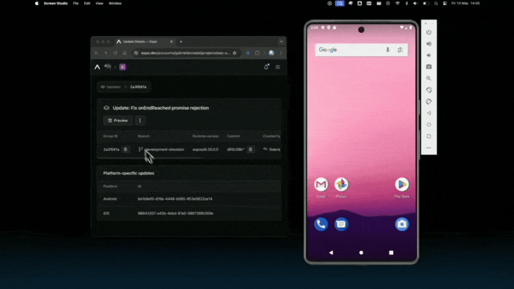

# **The Magic of new Expo Orbit 🚀**

$\textcolor{chocolate}{\text{Posted on Jun 27, 2024}}$

Hey **React Native 🩵** Developers,

The [**Expo**](https://x.com/expo) team has made mobile app development super interesting. Recently they published [**Expo orbit**](https://docs.expo.dev/build/orbit/) which is a **macOS** and **Windows** app that accelerates your development workflow by allowing one-click installation and launch of builds or updates from **EAS**, **local files**, or **Snack projects** on simulators and physical devices. Today we will explore more details about Expo orbit.

**CREDITS:** A big thanks to [**Kadi Kraman**](https://x.com/kadikraman) and [**Gabriel Donadel**](https://x.com/donadeldev) for their amazing talks on these topics at [**App Js Conf 2024**](https://x.com/appjsconf).

$\textcolor{mediumorchid}{\text{NOTE:}}$ If you want to learn more about **𝝠 Expo workflows (including Expo Go, Dev builds, prebuild, CNG, EAS, and Orbit)**, then read my detailed [**article**](https://github.com/anisurrahman072/React-Native-News-2024/blob/master/Expo-News/Expo-Go-to-EAS-build.md) on it.

# Before Expo orbit 😞

Before **Orbit**, installing **development builds** or **updates from EAS** (on Android and iOS physical devices or emulator/simulator) or running Snack projects on simulators was manual & time-consuming.

For instance, to install a **development** **build**, first, you need to download the archive from the builds that you created. Next, open the iOS simulators from Xcode and then drag and drop it into the simulator (in the case of iOS). A demo of it was shown by [**Gabriel Donadel**](https://x.com/donadeldev) in [**App Js Conf 2024**](https://github.com/anisurrahman072/React-Native-News-2024/blob/master/React-Native-Conference-Talks/App-Js-Conf-2024.md).


Similarly, to install **Snack projects**, additional steps need to be followed like installing **Expo Go** on the virtual device, then logging in using the expo credentials, and then selecting the Snack from the list. Ahh, lots of pain to run a simple **Snack** project 😞.


All of these complicated and lengthy processes daily are too much 🤦.

# Expo Orbit in action 🚀

Recently, the [**Expo**](https://expo.dev/) team released [**Expo Orbit**](https://docs.expo.dev/build/orbit/) (a macOS menu bar app that enables one-click build launches, and simulator management) **V1.0** in November 2023. Then in March of this year, they released **V1.1**, which supports launching **EAS Updates** (live app updates for a cloud build) directly in Android Emulators and iOS Simulators. Lastly, just a couple of days ago, [**Gabriel Donadel**](https://x.com/donadeldev) announced that from now on, **Expo Orbit** will also be supported on **Windows & Linux** (still in the [**Pre-release**](https://github.com/expo/orbit/releases/tag/expo-orbit-v2.0.0-preview.1) phase).

So, **Expo Orbit** makes all of the steps mentioned above as seamless as possible. As mentioned earlier, It is now very simple to launch your Android emulators and iOS simulators using Expo Orbit from the menu bar, as shown below.


### Installing Dev Builds by Expo Orbit

Also, now users can launch their builds from the website (Cloud builds) to Expo Orbit in a very easy manner, as shown below.


With this significant progress, the Expo team announced that Expo Orbit speeds up by **10x** when installing builds 🔥.

### Installing Snack projects by Expo Orbit

Similarly, you can also open **snack projects** using Expo Orbit within a couple of seconds, as shown below.


### Installing EAS Updates

Additionally, Expo Orbit can now install EAS updates (live app updates for a cloud build) from expo.dev on your devices or simulators, as shown below.



# Expo Orbit now supports multi-platforms 🚀

Besides macOS, Expo Orbit now also supports **Windows** and **Linux** in V2.0, which is still in the pre-release (experimental) phase. For Windows, it currently only supports x64 and x86 machines. Compatibility for other architectures will be available soon! Below is shown how Expo Orbit runs on Windows.


# Install Expo Orbit

I hope that, with all the magic of Expo Orbit mentioned above, you are interested enough to install it on your device today. To install on macOS, use the following command.

```bash
brew install expo-orbit
```

**NOTE:** You can download Orbit for **Windows** directly from the [GitHub releases](https://github.com/expo/orbit/releases/tag/expo-orbit-v2.0.0-preview.1).

# That's All 🙋‍♂️

I hope you enjoyed reading it. It would be really great if you could consider giving it a [**STAR**](https://github.com/anisurrahman072/React-Native-News-2024) ⭐️.

# About Author 👷‍♂️

I'm Anis, **Sr. React Native Engineer** and the author of [**React Native Advanced Guide Book**]() with **1.7K STAR** ⭐️. Over 5 years in **React Native** and **Full Stack**, I’ve built numerous production-grade apps. You can **[🩵 CONNECT me in X](https://twitter.com/anis_RNCore)** for any consultation.
