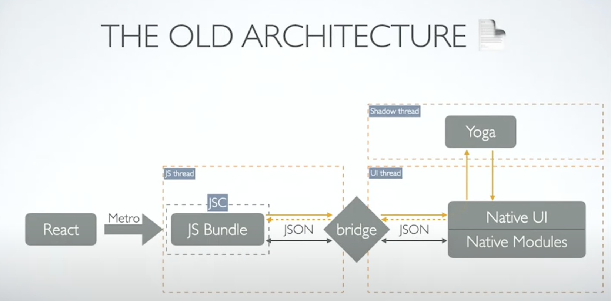
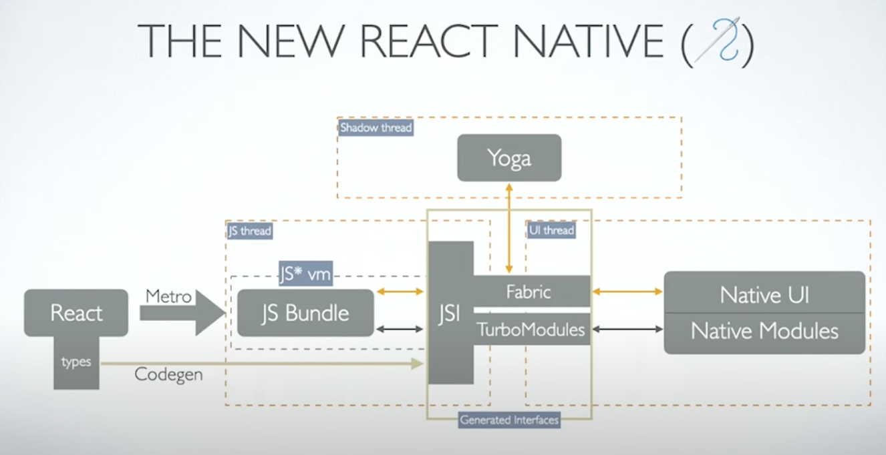

# How does React Native work behind the scenes? 🚀

Hey **React native** Developers,

A couple of months ago, the **React Native** team released version **0.74**, which includes Bridgeless Mode as the default when the New Architecture is enabled. They also mentioned that by 2024, the New Architecture itself will become the default. Additionally, they created a discussion on GitHub to notify library maintainers about upgrading their libraries to support the new architecture.

In today’s newsletter, we’ll **take a closer look** at the New Architecture and explore how it works based on [**Lorenzo**](https://x.com/Kelset)’s talk at [**React Native Heroes**](https://x.com/ReactNatHeroes) in May 2024. We’ll also discuss why investing in the migration to the new architecture is very important now.

# Important to know 👷‍♂️

Before getting into the technical details, let’s understand React Native **threads** and where they run. So, each React Native app consists of **two** main parts:

1. The **JavaScript code** and
2. The **native code**.

The code is executed over **three threads**:

1. **JavaScript thread:** It runs the JS Bundle with a specific JavaScript engine (Ex: Hermes).
2. **Native/UI thread:** It runs the native code (Ex: **Kotlin** or **Swift**) and handles any user interface operation like rendering or gesture events (Ex: Touch events).
3. **Shadow thread:** It calculates the position of native elements (Ex: View) in the layout.

Now, let’s take a brief look at the old architecture and its drawbacks before diving into the new architecture.

# The OLD Architecture

The **old architecture**, also known as **Paper**, has an important component: the **bridge** between the two threads (JS thread and UI thread), as shown in the image above.

### Bridge for communication: Drawbacks

This bridge acts as a message QUEUE that operates using a JSON data pattern. For example, when a user clicks a button, it triggers a method in the **native (UI) thread**. Afterward, the native thread sends a **JSON** message to the **JS thread**. The JS thread then identifies the event type and calls a specific method to execute an action (defined by app developers). Once the action is processed, the **JS thread** sends new JSON data back to the **native thread** as a response. The whole communication happens within the same channel, so you have a lot of messages going constantly back & forth which creates a **bottleneck**.

Another thing to note is that the two threads (JS & Native thread) don’t know about each other. They both handle JSON data they receive from the other side. So, they’re not aware when the other side is busy processing large JSON data.

# New Architecture in Action 🚀

To address the limitations of the old architecture, the team decided to create a new one. It builds upon the concept of JavaScript Interface (JSI) and removes bottlenecks by enabling direct communication between the **JavaScript** and **native threads**. Also, you can invoke the other side's methods directly from each other. All of this was achieved using the low-level language C++.

# **All Components of New Architecture**

- **Codegen** (Native code generator & also helpful for library developers 👷‍♂️)
- **JSI** *(JavaScript Interface that is written in C++. It is the core of New Architecture.)*
- **Hermes Engine** *(A **JS engine** that **runs JS** code in devices)*
- **Turbo Module** *(It Implements **Native Module** by using **JSI** & **Native Code**)*
- **Fabric** *(Native **UI renderer**/ New render engine/ New View Manager)*
- **Yoga** *(Cross-platform layout engine. It was also in OLD architecture)*

# **New Architecture - two Phases**

The **new Architecture** of **React Native** completes its full cycle in **2 phases**.

1. **Phase 1:** App **Build** time
2. **Phase 2:** App **Run** time

### **Phase 1: App Build time**

When a developer enables the New Architecture (as of **V0.74**) in the app and issues a build command for production deployment, it also generates native code during the build process using **`Codegen`**. It’s important to note that Codegen only operates during App Build time, not during App Run time.

### **Phase 2: App Run time**

After the build, when a user launches the app on their device, the rest of the work happens within the new architecture flow and executes all the components of the new architecture except for Codegen.

Now, let’s explore each of the new components of the New Architecture in simpler terms.

# Codegen (Native Code Generator)

Codegen is a tool in React Native’s New Architecture that uses **JSI (JavaScript Interface)** to generate platform-specific Native Code (Ex: Kotlin or Swift) from your written **typed JavaScript code** (Ex: Typescript). These generated native code can directly communicate with the **typed JavaScript code** without needing any help from the bridge. This results in faster and more reliable communication between JavaScript and native code.

### Codegen in real life ✌️

An interesting point is that it can help you in the CI system by tracking changes to native code in each new commit. If no changes are detected in the native code, you can simply push the JavaScript bundle to the production app without requiring a new submission to the app store. Additionally, you can determine when to re-run the entire app during development after pulling changes from your project collaborator by using Codegen.

Another benefit of Codegen is that it reduces the amount of work required for creating and maintaining native modules and components.

**`NOTE:`** When you have changes to the native code, you need to re-run the entire app to observe its full output.

# **JSI (JavaScript Interface)**

JSI means JavaScript Interface, which is written in C++. It is the core part of New Architecture as it is being used by every component of New Architecture. By using JSI, now the messaging between **JS thread** & **Native thread** is much quicker. Also, it has the feature of priority QUEUE that can handle any high-priority commands (Ex: While scrolling through a list, there will be no more white flashes).

### **JSI solved the asynchronous issue 🚀**

JSI brought both **synchronous & asynchronous** behavior in the communication of JS & native threads. However asynchronous calls are still preferred for most cases because they don’t block the **UI thread** or the **JS thread**. But, there are some situations where **synchronous** calls are necessary.

For example, some native methods need to return a value immediately to the JS code, such as **accessing the clipboard** or **getting the current location**. With JSI, these methods can be called synchronously from JS, without having to use **callbacks** or **promises**.

# Fabric (new rendering engine)

Fabric is the new **UIManager** (also known as **ViewManager**) responsible for rendering the UI on devices. It uses **JSI** to communicate with **Hermes** and **native code** for **rendering** the View.

### Fabric spreads react native everywhere 🔥

One of the main specialties of Fabric is that in **Fabric**, the **rendering engine** is separated from the core part of the Fabric (core part was written in C++). In the old architecture for iOS, that **rendering engine** was tied to **UIKit**, which made it impossible to use the **old architecture** with other frameworks like **SwiftUI** or **Jetpack Compose**. However, with Fabric, it is much easier to replace that rendering engine part with any other rendering engine. As a result, it opens the door to using React Native even in **watchOS** and **iOS Widgets** where you need to use SwiftUI for building your app.

# Turbo Module (new native module)

**Turbo Modules** is just a **Native Module system** that **replaced** the **OLD Native Module system**. The **OLD** one is also known as the **Bridge-based native module system** or **Legacy native module system** which used the technique of JSON data serialization (convert JSON to JS object) & it was slow in performance. But the new Turbo Module uses JSI which made it super fast in communication with JS thread & native thread.

One of the most exciting features of Turbo Module is that it introduced **`Lazy Loading`** for **Native Modules** (such as Bluetooth, Geo Location, and File Storage). In the old architecture, all Native Modules used in the app had to be initialized at startup, even if the user didn’t require one of these modules 🥴. However, by using Turbo Module, you can load a Native Module only when you need it. As a result, Turbo Module significantly improves app startup time.

# **Hermes**

It is a **JavaScript engine** that runs on devices when a user launches an App on his device. It was officially announced at **Chain React 2019** & first integrated with react native since version **0.60**. Then starting from React Native **V0.64**, Hermes became the **default** JavaScript engine. Before Hermes, the **JavaScriptCore** was used in react native. Some of the major benefits of using Hermes are.

1. It improves the **app size**
2. It improves **memory usage**, and
3. It improves the **start-up time** of the app

### Workflow of Hermes with New Architecture 🙌

At first, a developer builds the **`‘bytecode’`** of an app using **Hermes**. When they install and launch the app on their device, **Hermes** loads the ‘bytecode’ file, which contains both the **JavaScript code** and the **‘Native code’** of the app (the ‘Native code’ is generated by Codegen).

Hermes handles the logic, data, and events of the app (**Fabric** **UIManager** sends events to the **JS thread** with the help of **Hermes**) — such as fetching data from an API, updating the state, or responding to user input. It also communicates with the **‘Native code’** of the app using **JSI**. Additionally, **Hermes** updates the **UI** of the app using a **Fabric rendering engine**.

# React 18 with New Architecture

We all know that React 18 came with lots of new and exciting features, such as concurrent mode (which improves UI responsiveness by prioritizing rendering tasks) and suspense (which allows components to wait for asynchronous data). Most importantly, React 18 features were built with React Native’s new architecture in mind. Thanks to this new architecture, all the features of React 18 are now available in React Native as well! 🔥

**`NOTE:`** React 18 has been integrated since React Native version 0.69.

# Ship to New Architecture 🚀

To remove the app dependency from OLD **bridge** architecture, the React Native Team has introduced **three pillars** of New Architecture, which allow us to remove full dependency on the bridge.

1. **Turbo Modules:** It removed the app dependency on **native calls** from the bridge (released on V0.68)
2. **Fabric Renderer:** It removed the app dependency on **component rendering** from the bridge (released on V0.68)
3. **Bridgeless Mode:** It removed the app dependency on **everything else** (i.e: the rest of the React Native runtime: error handling, global event emitters, timers, and more) from the bridge (released on V0.73)

After releasing all three pillars with stable versions, the React Native team has decided to make the New Architecture the default within 2024 (possibly starting from React Native version 0.75) 🚀.

# Why invest in New Architecture 🎯

All the SDK maintainers (of both react native & expo) have started working to make their SDKs compatible with the New Architecture. Some SDK maintainers even mentioned that they will only support New Architecture in upcoming releases. Let’s take a look at some recent news from popular SDKs.

### React Native Vision Camera

Just 3 weeks ago [**Marc**](https://x.com/mrousavy) released [**V4.3.2**](https://github.com/mrousavy/react-native-vision-camera/releases/tag/v4.3.2) & in the release note he mentioned that -

> ❝ In a future version, react-native-vision-camera will require react-native 0.74 or higher, and will **only work on the new architecture**, so it is recommended to upgrade to react-native 0.74 and the new architecture as soon as possible. ❞

### React Native Gesture Handler

At the end of March 2024, the [**Software Mansion**](https://x.com/swmansion) team released [**V2.16.0**](https://github.com/software-mansion/react-native-gesture-handler/releases/tag/2.16.0) where they worked on New Architecture to support bridgeless mode 💯.

### React Native Reanimated

Three weeks ago [Software Mansion](https://x.com/swmansion) team made all the necessary changes to onboard **Layout Animations** (Ex: entering or exiting animations) for the New Architecture 🚀. ([**PR Link**](https://github.com/software-mansion/react-native-reanimated/pull/6055))

### Flash List

The [**shopify**](https://x.com/ShopifyEng) team also integrated **Fabric** into the **Flash List** just 3 weeks ago & made all the necessary changes for it. ([**PR Link**](https://github.com/Shopify/flash-list/pull/550))
