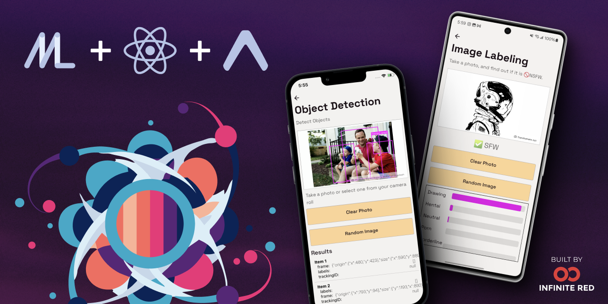
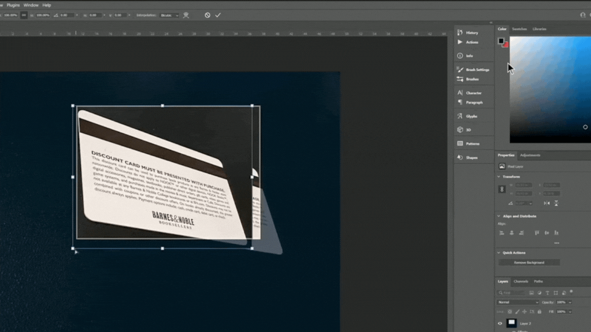
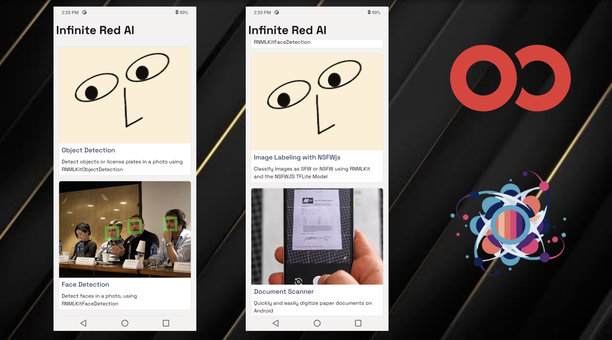
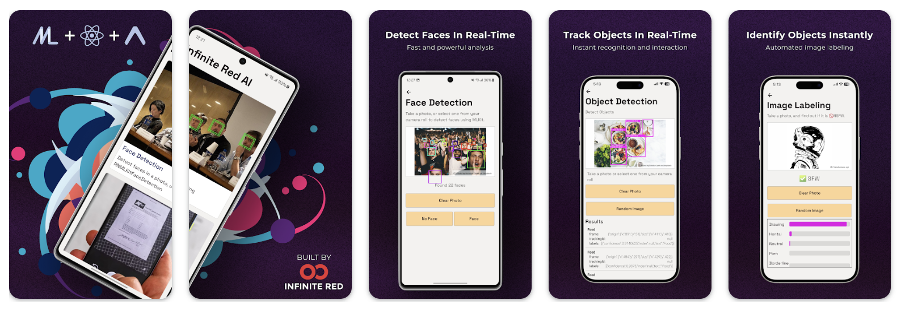

# React Native Now with On-Device ML (Machine Learning) Expertise 🔥

**DATE: <span style='color: cyan;'>Aug 15, 2024</span>**

Hey **React Native 🩵** Developers,

A few months ago, [**Software Mansion**](https://x.com/swmansion) organized [**App JS Conf 2024**](https://x.com/appjsconf). The exciting news from that conference is that the [**Infinite Red**](https://x.com/infinite_red) team has integrated on-device machine learning into React Native using [**Google ML Kit**](https://developers.google.com/ml-kit). Today, we will explore [**Gant Laborde**](https://x.com/GantLaborde)’s presentation at the conference on the newly created [**React Native MLKit**](https://docs.infinite.red/react-native-mlkit/) package.



**`NOTE:`** You can learn more about all the exciting talks at [**App JS Conf 2024**](https://appjs.co/) from [**here**](https://github.com/anisurrahman072/React-Native-News-2024/blob/master/React-Native-Conference-Talks/App-Js-Conf-2024.md).

# Before the Google ML Kit

To understand the importance of [**Google ML Kit**](https://developers.google.com/ml-kit), let’s explore a common scenario from our daily lives: **document scanning**. Imagine an insurance company app where users can upload images of documents (such as bank checks or cards) for the operational team to extract text and save it for further review.


Now, consider a situation where a user uploaded the image above (the card), and the operational team used online [**OCR (Optical Character Recognition)**](https://www.onlineocr.net/) tools like below to parse the text from the card.


Oops! OCR shows us **“No recognized text”**! But why? Did you notice that the image was taken at a right angle? Yeah, that's the reason why the online OCR tool can’t detect the image. So how fast can the operational team fix the angle issue of that image? One possible straightforward solution could be **Photoshop**. Let’s try 🤷‍♂️.



After editing in Photoshop, the image of the card now looks like below.


Now, let’s upload this new image of the card into that online OCR tool again.


Wow, now it has successfully parsed all the text from that image of the card! Isn’t it cool? But one point is ongoing in our minds, right? Yeah, that is **“How can we automate that Photoshop process mentioned above?”**. Specifically, how can we ensure that images are captured (or can be edited with one click) at the **correct angle**, no matter how they’re taken? (You can think for a moment 🤔).

### **The solution instead of Photoshop**

The solution is in **mathematics**! By using complex mathematical concepts such as linear algebra, linear transformations, and 3D/4D matrices, you can adjust photo angles directly on your phone with just a single click. No more need for Photoshop! Ahh, but developers don’t have enough time to do such rocket science with a deadline! So, what’s the alternative 🤔?

# Google ML Kit in action 💯

This is where the [**Google ML Kit**](https://developers.google.com/ml-kit) package comes into play. It removed the workload for developers dealing with deep linear algebra, linear transformations, and more.

### **What is Google ML Kit?**

[**Google ML Kit**](https://developers.google.com/ml-kit) is a mobile SDK (Software Development Kit) that brings Google’s machine-learning expertise to **Android** and **iOS** apps. It runs directly on users’ devices. This means that it moves the machine learning model into your phone, so you don’t have to worry about the internet anymore. You also don’t need to wait for any remote server to stream down the result to your phone. It only consumes your battery, without any server costs. Additionally, it protects your privacy as it works offline.

### Short brief on ML & AI

Hey, some of you may be worried about **ML (Machine Learning)** and **AI (Artificial Intelligence)** here. Let’s take a short intro on these two. **Machine learning** is a field (a part) of **artificial intelligence (AI)** that focuses on creating algorithms and models that are capable of learning from other data and making predictions based on examples. Some other parts of **AI** include:

- **Deep Learning:** A specialized form of **ML** that can solve complex tasks.
- **Robotics:** It involves creating intelligent machines capable of interacting with their environment.
- **Neural Networks:** It is the backbone of deep learning algorithms.

### **Features of Google ML Kit**

Now, let’s take a look at all the features that are available in the **Google ML Kit** SDK.

- Face Detection: Identifies and locates faces in images.
- Barcode Scanning: Reads and processes barcodes (QR code, Linear format, etc).
- Face Mesh: Detects detailed facial features (Ex: Location & shape of Eyes, Nose, etc).
- Text Recognition: Extracts text from images.
- Image Labeling: Identifies objects, locations, and activities from images.
- Object Tracking: Locates and tracks object in real time directly from the camera.
- Digital Ink: Identifies handwritten texts.
- Pose Detection: Determines the position of the human body parts.
- Selfie Segmentation: Separates users from the background in scenes.
- Subject Segmentation: Isolates subjects (people, pets, or objects) from picture backgrounds.
- Document Scanning: Detects document edges from the image & enhances quality. This feature can solve our above issue of Photoshop 💯.

# Google ML Kit in React Native 🔥

So, **Google ML Kit** has lots of amazing features! But when will **Google ML Kit** be available in **React Native**? The good news is that the [**@InfiniteRed**](https://x.com/infinite_red) team has already done it and published a library called [**React Native MLKit**](https://docs.infinite.red/react-native-mlkit/), which can even be used in **Expo** apps. Currently, it supports all the following features.

- Face Detection
- Object Detection
- Image Labeling
- Document Scanning

**`NOTE:`** The team is working hard to onboard all the other features in React Native that are available in the original **Google ML Kit** SDK. Additionally, the team has made the [**repository**](https://github.com/infinitered/react-native-mlkit) open-source. You can contribute even by giving the [**repo**](https://github.com/infinitered/react-native-mlkit) a **STAR ⭐️**. Kudos to all members of the team, especially [**Jamon**](https://x.com/jamonholmgren), [**Gant Laborde**](https://x.com/GantLaborde), [**Frank Calise**](https://x.com/frankcalise) & [**Mazen Chami**](https://x.com/mazenchami).

# Code with React Native MLKit

Now it is time to do some code. The team has published separate NPM packages for each of the modules mentioned above because they wanted to give developers the option to include only the modules they need in their app. All the common classes and logic are inside the “_@infinitered/react-native-mlkit-core_” package. Below, you’ll find the installation commands for both **Yarn** and **npm**.

```bash
# Face Detection #
# yarn
yarn add @infinitered/react-native-mlkit-face-detection
# npm
npm install @infinitered/react-native-mlkit-face-detection

# Image Labeling #
# yarn
yarn add @infinitered/react-native-mlkit-image-labeling
# npm
npm install @infinitered/react-native-mlkit-image-labeling

# Object Detection #
# yarn
yarn add @infinitered/react-native-mlkit-object-detection
# npm
npm install @infinitered/react-native-mlkit-object-detection

# Document Scanner #
# yarn
yarn add @infinitered/react-native-mlkit-document-scanner
# npm
npm install @infinitered/react-native-mlkit-document-scanner
```

### Code for Face Detection feature

Let’s take a look at a code example for the **[Face Detection](https://docs.infinite.red/react-native-mlkit/face-detection/list/)** feature. First, install the [**“Face Detection”**](https://docs.infinite.red/react-native-mlkit/face-detection/list/) package using the command above, and then wrap the entire app with the **`“Face Detection”`** context provider as shown below.

```tsx
/// App.tsx

import { RNMLKitFaceDetectionContextProvider } from "@infinitered/react-native-mlkit-face-detection";

function App() {
  return (
    <RNMLKitFaceDetectionContextProvider>
      {/* rest of your app goes here */}
    </RNMLKitFaceDetectionContextProvider>
  );
}
```

Now, you can detect faces in any photo by using the **`useFacesInPhoto`** hook, which only requires the image’s URI, as shown in the code snippet below. The hook will return three values.

1. **`faces`**: It is an array of objects where each object contains details of each face on the image (e.g., face X-axis angle, Y-axis angle, etc.).
2. **`error`**: It represents error details.
3. **`status`**: It shows the status while detecting faces from an image (e.g., ready, detecting, done, etc.).

```tsx
/// FaceDetectionScreen.tsx

import { useFacesInPhoto } from "@infinitered/react-native-mlkit-face-detection";

function FaceDetectionComponent() {
  const { faces, error, status } = useFacesInPhoto(
    "local_uri_of_your_image_uri"
  );

  if (error) {
    return <Text>Error: {error}</Text>;
  }

  return (
    <View>
      {faces.map((face) => (
        <View key={face.trackingId}>
          <Text>{JSON.stringify(face)}</Text>
        </View>
      ))}
    </View>
  );
}
```

Now, if you upload an image from your gallery (or take one instantly) with two **faces** (human face) and log the value of the **`faces`** array and **`status`** in the above code, you will see an output like below.


You’re almost there. Now that you have the face details, you just need to display the image on the screen with detected faces highlighted by **green** square boxes like below. To do that, pass the **`faces`** array as props to the **`<ImageWithBoundingBoxes/>`** component, which is imported from the _“@infinitered/react-native-mlkit-core”_ package. You can find the full code example [**here**](https://github.com/infinitered/react-native-mlkit/blob/3aca47e3e05350f304413d9dd30d30ee3d2542a3/apps/ExampleApp/app/components/RNMLKitImageView.tsx#L69).


# Demo Project is there 💯

The team has also created a **React Native app** using **Expo** and published it on [**GitHub**](https://github.com/infinitered/react-native-mlkit) for developers to explore the code implementation of all the available features of **React Native MLKit**. Follow the steps below to run it on your emulator or Android devices. We’ve shown here the setup for Android only, but you can also run the project on an iOS device by following this [**link**](https://docs.infinite.red/react-native-mlkit/running-the-example-app/ios/).

First, clone the project using the command below in your terminal.

```bash
git clone git@github.com:infinitered/react-native-mlkit.git
```

Now install all dependencies of the project.

```bash
cd react-native-mlkit
yarn install
```

Then you need to build the **native modules** by this below command. It may take some time.

```bash
yarn build
```

After the build, go to the **`~apps/ExampleApp`** directory & run the below command.

```bash
yarn android
```

After successfully running the app, you will see screens like the ones below, where you can explore & update the code of all available features provided by **React Native MLKit** SDK.



# Live App on Stores 🚀

The team has surprisingly published the demo app on both the [**Google Play Store**](https://play.google.com/store/apps/details?id=red.infinite.reactnativemlkit.example) and [**App Store**](https://apps.apple.com/us/app/react-native-mlkit/id6504584042). You can download the app instantly and explore all the available features of **React Native MLKit.**



# That's All 🙋‍♂️

I hope you enjoyed reading it. It would be really great if you could consider giving it a [**STAR**](https://github.com/anisurrahman072/React-Native-News-2024) ⭐️.

# About Author 👷‍♂️

I'm Anis, **Sr. React Native Engineer** and the author of [**React Native Advanced Guide Book**]() with **1.7K STAR** ⭐️. Over 5 years in **React Native** and **Full Stack**, I’ve built numerous production-grade apps. You can **[🩵 CONNECT me in X](https://twitter.com/anis_RNCore)** for any consultation.
